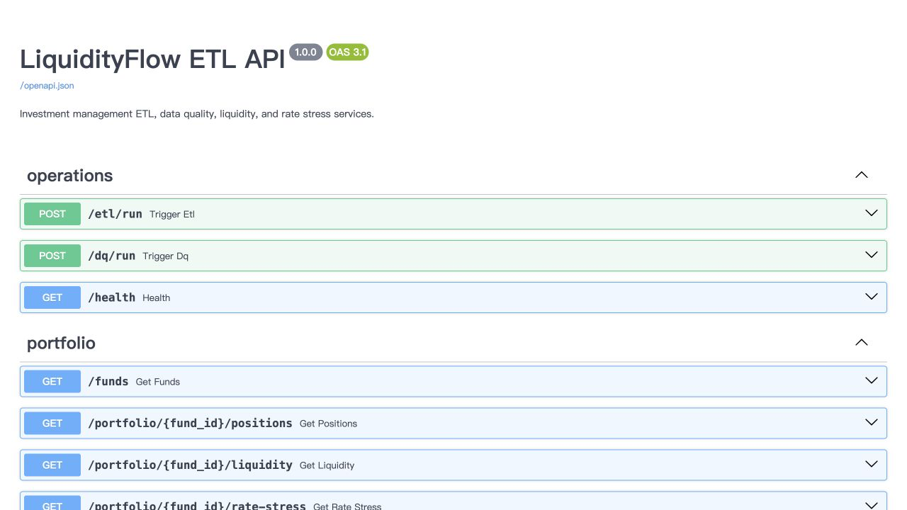
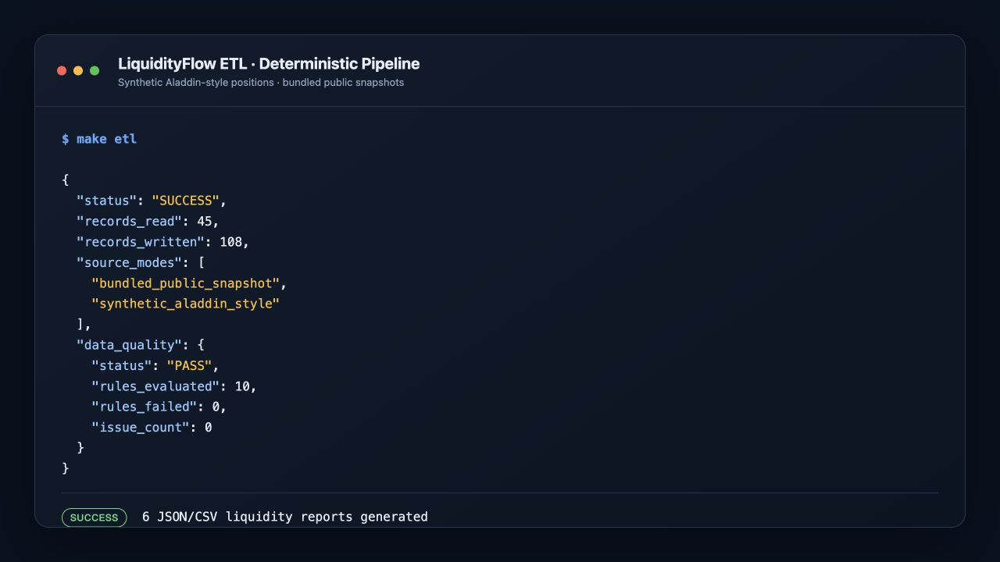
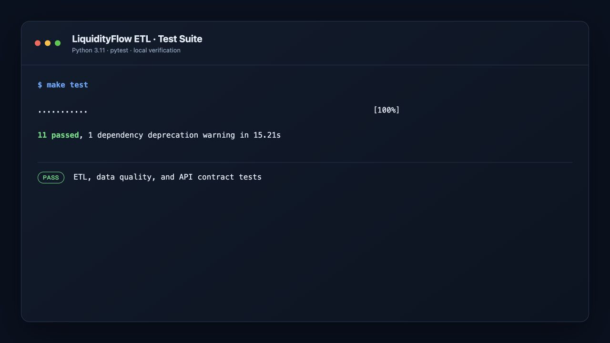

# LiquidityFlow ETL


**A production-style Python ETL, data quality, and liquidity-risk platform for investment management technology.**

LiquidityFlow models a daily post-valuation workflow: it ingests public fund and market context, receives a clearly synthetic portfolio file, stages source data in an ODS, enforces control rules, builds warehouse facts, calculates liquidity and rate-risk metrics, and publishes results through FastAPI and regulatory-style JSON/CSV extracts.

This is a portfolio implementation—not an official regulatory filing system, trading system, or investment recommendation. It contains no proprietary Aladdin data. “Aladdin-style” means only a locally generated, generic position-file shape.

## Why this project matters

Investment data engineering is not just moving rows. A credible daily platform must answer: Which source arrived? Was it current? Did positions reconcile to NAV? Can a reviewer trace a report back to an ETL run? What happens when a public endpoint is unavailable? LiquidityFlow makes those controls visible through source provenance, ODS/warehouse separation, ten pandas DQ rules, run logs, alerts, deterministic fallbacks, and testable APIs.

The project directly demonstrates Python 3.11+, pandas DataFrames, FastAPI, REST, SQLAlchemy, DuckDB, SQL, UNIX-style commands, financial data, liquidity monitoring, rate stress, regulatory-style reporting, tests, CI, and containerized local operation.

## Architecture

```text
SEC Series/Class ─┐
FRED H.15 rates ──┼─> source adapters ─> ODS schema ─> pandas controls ─┐
FINRA margin ─────┤     + provenance                                  │
Synthetic         │     + explicit fallback                           ├─> warehouse
positions + NAV ──┘                                                    │
                                                                       │
        run logs <──────────── ETL orchestration ──────────────────────┘
                                    |
                 +------------------+-------------------+
                 |                  |                   |
          DQ issues/alerts   liquidity + stress   JSON/CSV reports
                 |                  |                   |
                 +------------------+-------------------+
                                    |
                              FastAPI service
```

The standard run is deliberately offline and reproducible. `make etl-public` attempts official downloads and automatically records an explicit `bundled_public_snapshot` fallback if a source is unavailable.

## Data sources and boundaries

| Input | Use | Runtime behavior |
|---|---|---|
| [SEC Investment Company Series/Class](https://www.sec.gov/data-research/sec-markets-data/investment-company-series-class-information) | Fund IDs, class IDs, CIK, name, ticker | Official CSV when requested; SEC-derived snapshot otherwise |
| [FRED DGS2 and DGS10](https://fred.stlouisfed.org/graph/fredgraph.csv?id=DGS2,DGS10) | H.15 Treasury rate context | Official CSV when requested; dated snapshot otherwise |
| [FINRA Margin Statistics](https://www.finra.org/rules-guidance/key-topics/margin-accounts/margin-statistics) | Aggregate leverage/liquidity-risk context | Official web table when requested; dated snapshot otherwise |
| Local synthetic generator | Positions and NAV for three funds | Always synthetic, deterministic, and labeled `synthetic_aladdin_style` |

SEC notes that filer-maintained fields may contain errors. FINRA states that its margin statistics are aggregate monthly data and that no data feed is available. The adapters preserve source URLs and modes so a downstream user can distinguish a current attempt from a bundled snapshot.

## Quick start

Prerequisites: Python 3.11+, `make`, and a UNIX-like shell.

```bash
git clone <your-repository-url>
cd liquidityflow-etl
make setup
make etl
make api
```

Open [http://localhost:8000/docs](http://localhost:8000/docs) for interactive OpenAPI documentation.

To attempt current public downloads:

```bash
make etl-public
```

To run with Docker:

```bash
docker compose up --build
curl -X POST http://localhost:8000/etl/run
```

## Commands

| Command | Purpose |
|---|---|
| `make setup` | Create `.venv` and install dependencies |
| `make etl` | Run deterministic ETL with bundled public snapshots |
| `make etl-public` | Attempt official SEC/FRED/FINRA reads |
| `make api` | Start FastAPI on port 8000 |
| `make dq` | Run DQ on the current warehouse snapshot |
| `make test` | Run unit, integration, and API tests |
| `make coverage` | Show test coverage |
| `make compile` | Compile-check source and tests |
| `make clean` | Remove local database and generated reports |

Configuration lives in environment variables; see [.env.example](.env.example). DuckDB is the default. An approved DB2 or Sybase/SAP ASE SQLAlchemy URL and driver can be introduced at the engine boundary, but this repository does not claim those enterprise connections have been executed.

## REST API

| Method | Endpoint | Purpose |
|---|---|---|
| GET | `/health` | Service health |
| POST | `/etl/run` | Run deterministic ETL; `?refresh_public=true` opts into downloads |
| POST | `/dq/run` | Run DQ against the current warehouse |
| GET | `/dq/issues` | Recent issue details |
| GET | `/dq/summary` | Latest rule-level pass/fail summary |
| GET | `/funds` | Fund reference dimension |
| GET | `/portfolio/{fund_id}/positions` | Current holdings |
| GET | `/portfolio/{fund_id}/liquidity` | Liquidity bucket exposure |
| GET | `/portfolio/{fund_id}/rate-stress` | ±100 bps duration stress |
| GET | `/regulatory/liquidity-report/{fund_id}` | Regulatory-style JSON; add `?format=csv` for CSV |
| GET | `/alerts` | Persisted DQ alerts |

Example calls:

```bash
curl -X POST http://localhost:8000/etl/run
curl http://localhost:8000/dq/summary
curl http://localhost:8000/portfolio/S000009117/liquidity
curl http://localhost:8000/regulatory/liquidity-report/S000009117
curl -OJ 'http://localhost:8000/regulatory/liquidity-report/S000009117?format=csv'
```

## Sample output

Representative ETL response from the deterministic path:

```json
{
  "status": "SUCCESS",
  "records_read": 45,
  "source_modes": [
    "bundled_public_snapshot",
    "synthetic_aladdin_style"
  ],
  "data_quality": {
    "status": "PASS",
    "rules_evaluated": 10,
    "rules_failed": 0,
    "issue_count": 0
  }
}
```

Representative liquidity report section:

```json
{
  "fund": {"fund_id": "S000009117", "ticker": "FSTBX"},
  "portfolio_summary": {
    "total_market_value": 87512950.0,
    "cash_pct": 9.1415,
    "illiquid_pct": 6.2848
  },
  "liquidity_buckets": [
    {"liquidity_bucket": "Daily Liquid", "exposure_pct": 69.3155},
    {"liquidity_bucket": "Weekly Liquid", "exposure_pct": 19.1445},
    {"liquidity_bucket": "Monthly Liquid", "exposure_pct": 5.2552},
    {"liquidity_bucket": "Illiquid", "exposure_pct": 6.2848}
  ]
}
```

Each ETL writes JSON and CSV reports for all three synthetic funds into `outputs/`. Generated files and the local DuckDB database are intentionally ignored by Git.

## Screenshots

### FastAPI OpenAPI Docs


### ETL Run Output


### Test Suite


## Data quality controls

| Rule | Check | Severity |
|---|---|---|
| DQ001 | `fund_id` is not null | Error |
| DQ002 | `security_id` is not null | Error |
| DQ003 | Position date is not in the future | Error |
| DQ004 | Market value equals quantity × price within tolerance | Error |
| DQ005 | Fund + security + position date is unique | Error |
| DQ006 | Price is no older than three business days | Warning |
| DQ007 | Bond maturity follows position date | Error |
| DQ008 | Liquidity bucket is assigned | Error |
| DQ009 | Portfolio market value reconciles to NAV | Error |
| DQ010 | Asset class belongs to the approved domain | Error |

Rules are evaluated with pandas and produce issue-level rows. Error-level failures also create summarized open alerts. See the full [data dictionary](docs/data_dictionary.md).

## Analytics

- Liquidity bucket exposure by fund
- Top-ten concentration by issuer and security
- Cash and illiquid percentages
- Duration-based +100 bps and -100 bps parallel-rate shocks
- Daily DQ pass/fail summary
- Regulatory-style JSON and CSV liquidity report

The rate scenario is intentionally simple and explainable: `estimated P&L = -modified duration × yield shock × market value`. It is not a full fixed-income valuation model.

## Database schemas

`ods` contains source-shaped current snapshots for fund reference, Treasury rates, FINRA margin, positions, and NAV. `warehouse` contains a fund dimension; position, NAV, rate, margin, liquidity, and stress facts; plus ETL run, DQ issue, and alert records.

- [ODS DDL](sql/ods_schema.sql)
- [Warehouse DDL](sql/warehouse_schema.sql)
- [Analyst sample queries](sql/sample_queries.sql)

## Repository map

```text
src/ingest/      public adapters + synthetic position generator
src/etl/         transformations, loaders, daily orchestration
src/quality/     rule catalog, execution, persistence, alerting
src/analytics/   liquidity, concentration, rate stress, reports
src/api/         FastAPI app and route modules
sql/             ODS/warehouse DDL and analyst queries
docs/            business, SDLC, design, dictionary, runbook
tests/           DQ unit, ETL integration, and API contract tests
```

## SDLC documentation

- [Business requirements](docs/business_requirements.md)
- [Jira epics and user stories](docs/jira_epics_and_stories.md)
- [Technical design](docs/technical_design.md)
- [Data dictionary](docs/data_dictionary.md)
- [Operations runbook](docs/runbook.md)

GitHub Actions validates Python 3.11 and 3.12, compiles the code, runs tests with coverage, and executes the deterministic ETL smoke path.

## Job relevance

LiquidityFlow maps directly to Python ETL Developer work: Python orchestration and pandas-based DQ rules move investment data through SQL ODS and warehouse layers, while FastAPI exposes controlled liquidity and risk outputs. Tests, GitHub Actions, Docker, SDLC documentation, and an operations runbook demonstrate a maintainable UNIX-style delivery workflow. The database boundary uses SQLAlchemy so approved enterprise dialects could be introduced with the appropriate drivers and DDL testing; this project does not claim executed DB2 or Sybase/SAP ASE integrations.

## Resume bullets

- Built a production-style Python/pandas investment-data pipeline integrating SEC fund reference, FRED H.15 rates, FINRA margin context, and synthetic multi-asset positions into DuckDB ODS and warehouse schemas through SQLAlchemy.
- Implemented 10 auditable data-quality controls, NAV reconciliation, issue lineage, operational alerts, ETL run logging, and deterministic public-source fallback behavior, verified by unit and end-to-end tests in GitHub Actions.
- Delivered FastAPI services and JSON/CSV liquidity reporting for bucket exposure, concentration, cash/illiquid percentages, and transparent ±100 bps duration stress scenarios.

## Interview explanation

> I designed LiquidityFlow around the daily control point between source ingestion and portfolio reporting. Public sources provide reference and market context, while the positions are explicitly synthetic because production Aladdin data is proprietary. Every source records provenance, lands in an ODS, and is normalized with pandas before warehouse loading. I run ten row- and fund-level controls, persist issues and alerts with run lineage, then calculate liquidity and first-order rate stress metrics. FastAPI exposes the same curated data used by the JSON/CSV reports. DuckDB keeps the demo reproducible, while SQLAlchemy isolates database access so an approved enterprise dialect could be introduced without rewriting business logic.

## License

MIT. Public-source content remains subject to the originating agencies' terms and notices.
